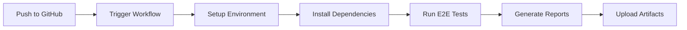

# 🚀 CI/CD Pipeline Setup for SpiceJet E2E Tests

This document explains how to set up and use the GitHub Actions CI/CD pipeline for running SpiceJet E2E tests.

## 📋 **Overview**

The CI/CD pipeline automatically runs your SpiceJet E2E tests whenever you push code to the repository. It uses GitHub Actions with a headless Chrome browser for reliable test execution.

## 🏗️ **Pipeline Architecture**



## 📁 **Files Structure**

```
├── .github/
│   └── workflows/
│       └── e2e-tests.yml              # GitHub Actions workflow
├── src/test/resources/
│   └── ci-testng.xml                  # CI-specific TestNG suite
├── pom.xml                            # Updated with CI profile
├── CI-CD-SETUP.md                     # This documentation
└── src/main/java/com/automation/utils/
    └── DriverManager.java             # Updated for headless mode
```

## ⚙️ **Configuration Details**

### 1. **GitHub Actions Workflow** (`.github/workflows/e2e-tests.yml`)

**Triggers:**
- Push to `main` or `master` branch
- Pull requests to `main` or `master` branch  
- Manual trigger via GitHub Actions UI

**Environment:**
- **OS**: Ubuntu Latest
- **Java**: OpenJDK 11 (Temurin)
- **Browser**: Chrome (headless mode)
- **Maven**: Latest version

**Steps:**
1. ✅ Checkout repository code
2. ✅ Setup Java 11 environment
3. ✅ Cache Maven dependencies
4. ✅ Install Chrome browser
5. ✅ Setup ChromeDriver
6. ✅ Compile project
7. ✅ Run E2E tests in headless mode
8. ✅ Upload test reports as artifacts
9. ✅ Generate test summary

### 2. **Maven Profiles**

#### **CI Profile** (`-Pci`)
```xml
<profile>
    <id>ci</id>
    <properties>
        <browser>chrome</browser>
        <headless>true</headless>
        <test.timeout>30</test.timeout>
    </properties>
</profile>
```

#### **Local Profile** (default)
```xml
<profile>
    <id>local</id>
    <properties>
        <browser>chrome</browser>
        <headless>false</headless>
    </properties>
</profile>
```

### 3. **Headless Browser Configuration**

The `DriverManager` automatically detects CI environment and configures Chrome with:
- `--headless`: Run without GUI
- `--no-sandbox`: Required for CI environments
- `--disable-dev-shm-usage`: Prevent memory issues
- `--window-size=1920,1080`: Set viewport size
- `--disable-gpu`: Disable GPU acceleration

## 🚀 **How to Use**

### **Method 1: Automatic Triggers**

1. **Push to main branch:**
   ```bash
   git add .
   git commit -m "Update E2E tests"
   git push origin main
   ```

2. **Create Pull Request:**
   - Create a PR targeting `main` branch
   - Tests run automatically on PR creation/update

### **Method 2: Manual Trigger**

1. Go to your GitHub repository
2. Navigate to **Actions** tab
3. Select **"SpiceJet E2E Tests"** workflow
4. Click **"Run workflow"** button
5. Select branch and click **"Run workflow"**

### **Method 3: Local Testing with CI Profile**

Test CI configuration locally:
```bash
# Run with CI profile (headless)
mvn test -Pci

# Run specific E2E test
mvn test -Pci -Dtest=SpiceJetHybridE2ETest

# Run with custom browser
mvn test -Pci -Dbrowser=firefox
```

## 📊 **Test Reports & Artifacts**

### **Artifacts Generated:**
1. **Test Reports** (`target/surefire-reports/`)
   - TestNG XML reports
   - HTML reports
   - Test failure details

2. **ExtentReports** (`reports/`)
   - Rich HTML reports with screenshots
   - Step-by-step execution logs
   - Pass/Fail status with timing

3. **Test Summary**
   - GitHub Actions generates test summary
   - PR comments with test results
   - Failure notifications

### **Accessing Reports:**
1. Go to **Actions** tab in GitHub
2. Click on the workflow run
3. Scroll down to **Artifacts** section
4. Download `test-reports` or `extent-reports`

## 🔧 **Customization Options**

### **1. Add More Tests**

Update `ci-testng.xml` to include additional test classes:
```xml
<classes>
    <class name="com.automation.tests.SpiceJetHybridE2ETest"/>
    <class name="com.automation.tests.YourNewE2ETest"/>
</classes>
```

### **2. Change Browser**

Update the CI profile in `pom.xml`:
```xml
<properties>
    <browser>firefox</browser>  <!-- or edge -->
    <headless>true</headless>
</properties>
```

### **3. Run on Different Triggers**

Modify `.github/workflows/e2e-tests.yml`:
```yaml
on:
  push:
    branches: [ main, develop ]  # Add more branches
  schedule:
    - cron: '0 2 * * *'         # Run daily at 2 AM
```

### **4. Parallel Execution**

Update `ci-testng.xml` for parallel testing:
```xml
<suite name="SpiceJet E2E CI Suite" parallel="methods" thread-count="2">
```

## 🐛 **Troubleshooting**

### **Common Issues:**

1. **Tests failing in CI but passing locally**
   - Check headless mode compatibility
   - Verify timeouts are sufficient
   - Review browser console logs

2. **ChromeDriver compatibility issues**
   - WebDriverManager handles this automatically
   - Check Chrome version in workflow logs

3. **Memory issues**
   - Increase timeout values
   - Use `--disable-dev-shm-usage` flag (already included)

4. **Element not found errors**
   - Increase wait times for CI environment
   - Use more robust locator strategies

### **Debug Mode:**

Add debug information to workflow:
```yaml
- name: Debug Information
  run: |
    echo "Browser: ${{ env.BROWSER }}"
    echo "Headless: ${{ env.HEADLESS }}"
    google-chrome --version
    chromedriver --version
```

## 📈 **Best Practices**

1. **✅ Keep tests independent** - Each test should run in isolation
2. **✅ Use stable locators** - Avoid brittle selectors that may change
3. **✅ Handle dynamic content** - Use proper waits for AJAX calls
4. **✅ Minimize test dependencies** - Reduce external API calls when possible
5. **✅ Regular maintenance** - Update browser versions and dependencies

## 🔄 **Workflow Status**

You can monitor your CI/CD pipeline status:

- **Badge for README:**
  ```markdown
  
  ```

- **Check workflow status:**
  - Green ✅ = All tests passed
  - Red ❌ = Tests failed
  - Yellow ⏳ = Tests running

## 🎯 **Next Steps**

1. **Setup Repository Secrets** (if needed for environment variables)
2. **Configure Slack/Email Notifications** for test failures
3. **Add Performance Testing** to the pipeline
4. **Setup Staging Environment Tests** before production deployment
5. **Implement Test Data Management** for consistent test scenarios

---

🚀 **Your SpiceJet E2E tests are now running automatically in the cloud!**
